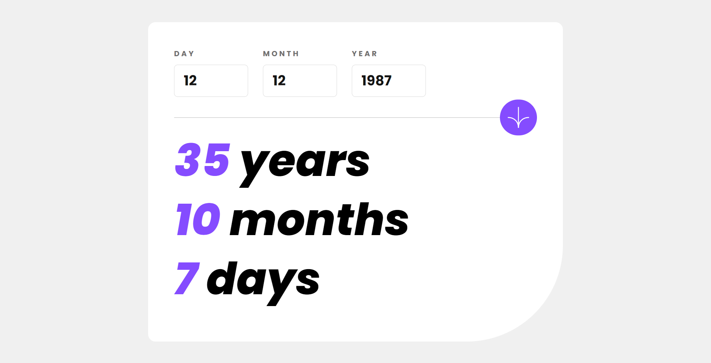

# Frontend Mentor - Age calculator app solution

This is a solution to the [Age calculator app challenge on Frontend Mentor](https://www.frontendmentor.io/challenges/age-calculator-app-dF9DFFpj-Q). Frontend Mentor challenges help you improve your coding skills by building realistic projects.

### Table of contents

- [Overview](#overview)
  - [The challenge](#the-challenge)
  - [Screenshot](#screenshot)
  - [Links](#links)
- [Built with](#built-with)
- [Author](#author)

### Overview

#### The challenge

Users should be able to:

- View an age in years, months, and days after submitting a valid date through the form
- Receive validation errors if:
  - Any field is empty when the form is submitted
  - The day number is not between 1-31
  - The month number is not between 1-12
  - The year is in the future
  - The date is invalid e.g. 31/04/1991 (there are 30 days in April)
- View the optimal layout for the interface depending on their device's screen size
- See hover and focus states for all interactive elements on the page

#### Screenshot

#### Links

- Solution URL: [Solution URL](https://www.frontendmentor.io/solutions/age-calculator-app-a2QdObiex5)
- Live Site URL: [Live Site URL](https://sam4web.github.io/age_calculator_app/)

### Built with

- Semantic HTML5 markup
- CSS custom properties
- Flexbox
- Mobile-first workflow
- [React.js](https://react.dev/)
- [Tailwind CSS](https://tailwindcss.com/)

### Author

- Sijal Manandhar
- Github - [sam4web](https://github.com/sam4web/)
- Frontend Mentor - [@sam4web](https://www.frontendmentor.io/profile/sam4web)
